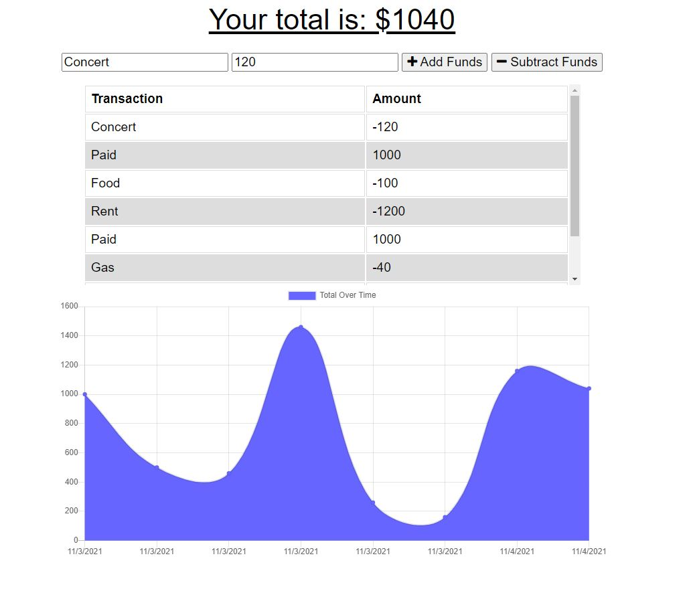

# Budget Tracker

# Table of Contents

[Description](#description) -
[Usage](#usage) - 
[Technologies](#technologies) -
[Links](#links) - 
[Contact](#contact) -
[Technologies](#technologies) -
[License](#license)

## Description

## Install

Please use **'npm i'** in the command line to install the dependencies. This program uses MongoDB, Mongoose, and ExpressJS.

## Usage

When ready use **'npm start'** into the command line to run.

## Links

  
[Walkthrough Video]()  
[Deployed App]()  
[GitHub](https://github.com/niklasertle/nje-budget-tracker)

## Contact

[GitHub Profile](https://github.com/niklasertle) 
[Email Me](mailto:nik.ertle16@gmail.com)

## Technologies

